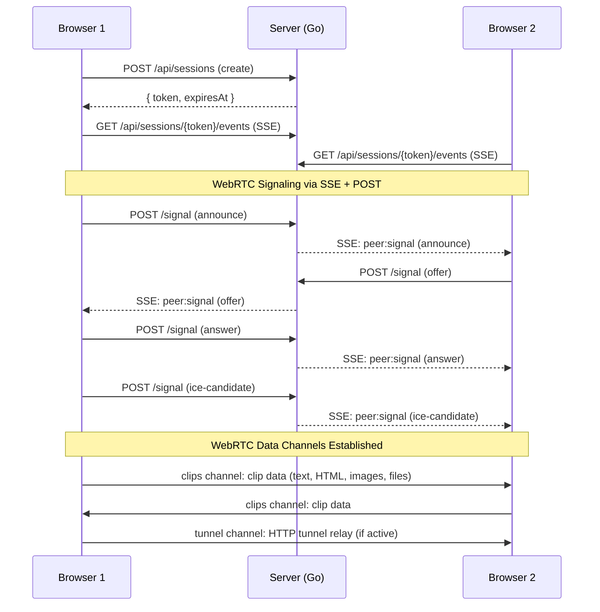
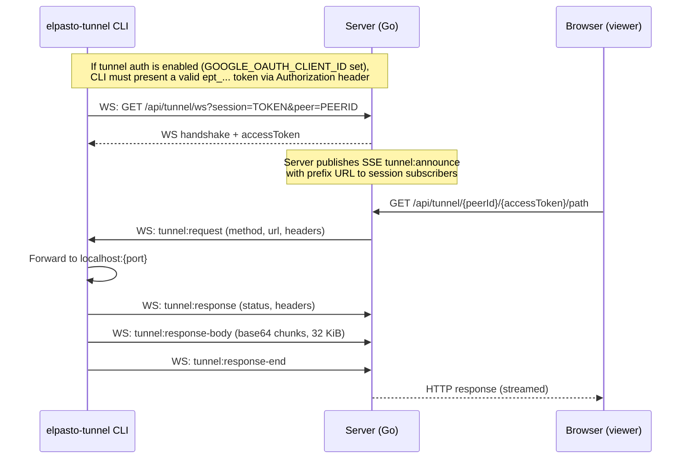
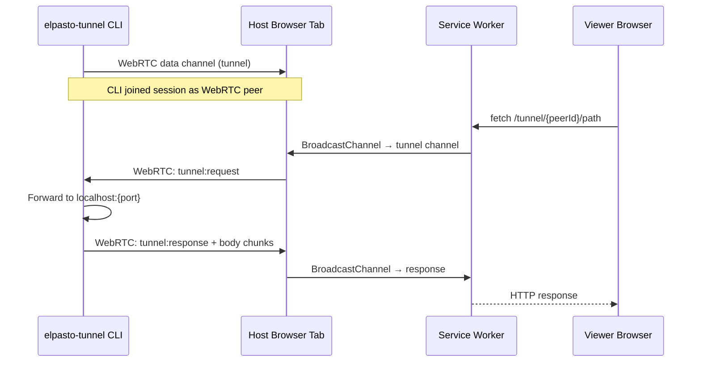
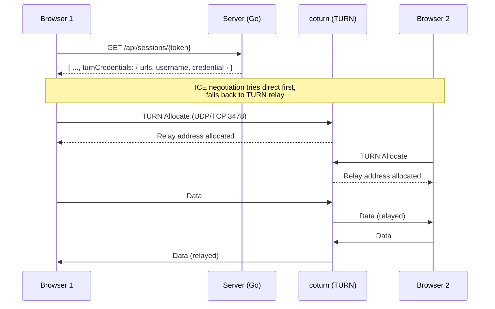

# elPasto — Architecture

## Overview

elPasto is a shared clipboard web app. Users open the same session URL on multiple devices, paste content into user-managed threads, and content syncs in real-time. Clip payloads never touch the server — they move peer-to-peer via WebRTC data channels and persist in browser-local IndexedDB.

The server handles session metadata, WebRTC signaling (via SSE), and optional TURN/tunnel relay infrastructure.

## Network Topology

```
                        Internet
                           │
                   ┌───────┴───────┐
                   │ Reverse proxy │
                   │  / TLS edge   │
                   └───────┬───────┘
                           │
       your-domain.example ┤
                           │
              ┌────────────┴────────────┐
              │      App host           │
              │   Docker: port 3001     │
              │                         │
              │  ┌───────────────────┐  │
              │  │   Go binary       │  │
              │  │  API + frontend   │  │
              │  │  SSE signaling    │  │
              │  │  tunnel relay     │  │
              │  └───────────────────┘  │
              │                         │
              │  ┌───────────────────┐  │
              │  │   coturn          │  │
              │  │  TURN relay       │  │
              │  │  UDP 3478         │  │
              │  │  UDP 49152-49200  │  │
              │  └───────────────────┘  │
              └─────────────────────────┘
                           │
                    ┌──────┴──────┐
                    │   Router    │
                    │  port fwd   │
                    │  UDP 3478   │
                    │  UDP 49152+ │
                    └──────┬──────┘
                           │
                    <public IP>
                           │
                turn.your-domain.example
                  (DNS-only, not proxied)
```

## Connection Flow



## HTTP Tunnel — Two Routing Paths

The `elpasto-tunnel` CLI exposes a local HTTP service through a session. There are two routing paths for tunnel traffic. The server relay is the default; WebRTC relay is available as a fallback.

### Path 1: Server Relay (default)

The CLI connects to the server via WebSocket. The server proxies HTTP requests from browsers directly to the CLI — no browser tab needs to stay open on the tunnel host.



**Key properties:**
- Capability URL: `/api/tunnel/{peerId}/{accessToken}/...` — accessToken is random 24-byte base64url, rotates on reconnect
- CLI auto-reconnects with exponential backoff (1s-30s)
- 30s WebSocket keepalive pings (survives Cloudflare idle timeout)
- No Service Worker required on the browser side
- Per-session limit: 5 tunnels, global limit: 100
- Request body cap: 10 MB, sensitive headers stripped
- Optional Google OAuth gate: when `GOOGLE_OAUTH_CLIENT_ID` is set, CLI must authenticate via `GET /api/auth/tunnel/start` → Google OAuth → `GET /api/auth/tunnel/callback` before connecting; token cached at `~/.config/elpasto/tunnel-token`; 401/403 does NOT fall back to WebRTC

### Path 2: WebRTC Relay (fallback)

Traffic flows browser-to-browser over the WebRTC `tunnel` data channel. This requires a browser tab open on the tunnel host's session page, and a Service Worker to intercept fetch requests.



**Key properties:**
- Requires host browser tab to stay open (relays through the session page JS)
- Service Worker (`tunnel-sw2.js`) intercepts `/tunnel/` requests
- BroadcastChannel bridges SW ↔ page JS ↔ WebRTC data channel
- Max 8 concurrent in-flight relay requests
- Works even if the server doesn't support the `/api/tunnel/ws` endpoint

### Forcing WebRTC Relay

> **Not yet implemented.** The tunnel currently auto-upgrades to server relay when available and falls back to WebRTC only if the backend lacks the `/api/tunnel/ws` endpoint. A `--force-webrtc` flag on the CLI would skip the server relay attempt and connect purely via WebRTC, useful for:
>
> - Testing the WebRTC path in isolation
> - Environments where the server relay is blocked or rate-limited
> - Privacy-sensitive scenarios where traffic shouldn't traverse the server

## TURN Relay (NAT Traversal)

When direct WebRTC connections fail (symmetric NAT, restrictive firewalls), peers fall back to TURN relay via coturn.



**Key properties:**
- HMAC-SHA1 ephemeral credentials generated per session fetch (`TURN_SECRET` shared between Go and coturn)
- Credentials are never stored — generated on-the-fly, short-lived
- coturn `denied-peer-ip` blocks all RFC 1918 ranges, Tailscale CGNAT, and link-local (prevents relay into LAN)
- Optional: when `TURN_SECRET` is unset, session responses omit credentials and app uses STUN only
- DNS: point `turn.your-domain.example` at your public IP (DNS-only, not proxied)
- Router forwards UDP+TCP 3478 and UDP 49152-49200 to the host running coturn

## Data Flow Summary

```
┌─────────────────────────────────────────────────────────────┐
│                    What goes where                           │
├──────────────────────┬──────────────────────────────────────┤
│  Server (Go)         │  Session metadata (token, expiry)    │
│                      │  WebRTC signaling relay (SSE+POST)   │
│                      │  Tunnel relay (WS proxy, ephemeral)  │
│                      │  TURN credential generation          │
│                      │  Visitor stats (hashed IPs, counters)│
│                      │  Snapshot persistence (dirty-flag)   │
├──────────────────────┼──────────────────────────────────────┤
│  Browser (IndexedDB) │  All clip content (text/HTML/images) │
│                      │  Binary file data (incl. zipped dirs)│
│                      │  Encryption keys (normal + paranoid) │
│                      │  Session history, peer names, labels │
│                      │  Thread metadata (names, order)      │
│                      │  Deletion tombstones (500/session)   │
├──────────────────────┼──────────────────────────────────────┤
│  WebRTC (in-flight)  │  Clip payloads (peer-to-peer)       │
│                      │  Tunnel HTTP relay (when WebRTC path)│
│                      │  Control: catalog, delete, update    │
│                      │  Control: thread sync/CRUD           │
│                      │  Control: peer names                 │
├──────────────────────┼──────────────────────────────────────┤
│  coturn (in-flight)  │  Relayed WebRTC media (opaque)      │
│                      │  No data stored                      │
└──────────────────────┴──────────────────────────────────────┘
```

## coturn Monitoring

When the Compose `turn` profile is enabled, coturn exposes Prometheus metrics on port 9641 (`network_mode: host`, no port mapping needed). A cron script (`infra/coturn/monitor.sh`) polls every 2 minutes and sends alerts via [ntfy.sh](https://ntfy.sh).

**Thresholds:**
| Metric | Threshold | Priority |
|--------|-----------|----------|
| Active allocations | > 20 | urgent |
| New allocations per check | > 30 | high |
| Traffic delta per check | > 50 MB | high |

**Setup on the host running coturn:**
```bash
# Subscribe to alerts on your phone:
#   Install ntfy app → subscribe to "<your-ntfy-topic>"

# Add cron job:
crontab -e
# */2 * * * * NTFY_TOPIC=<your-ntfy-topic> ~/elpasto/infra/coturn/monitor.sh
```

A low-priority status summary is sent every ~30 minutes with current active allocations, total allocation count, and cumulative traffic.

## Tunnel Route Decision

```
elpasto-tunnel CLI starts
         │
         ▼
   Tunnel auth enabled?
   (GOOGLE_OAUTH_CLIENT_ID set)
         │
    ┌────┴────┐
    │   Yes   │──── Load/obtain ept_... token
    └─────────┘    (browser OAuth if no cached token)
         │
         ▼
   Try GET /api/tunnel/ws
   (WebSocket to server)
         │
    ┌────┴────┐
    │ Success │──── Server Relay path
    └─────────┘    (default, no browser tab needed)
         │
    ┌────┴─────┐
    │ 401/403  │──── Fail (no WebRTC fallback,
    └──────────┘     prevents auth bypass)
         │
    ┌────┴────┐
    │  404    │──── Fall back to WebRTC
    └─────────┘    (needs host browser tab open)
         │
         ▼
   [Future: --force-webrtc flag
    skips server relay attempt]
```
